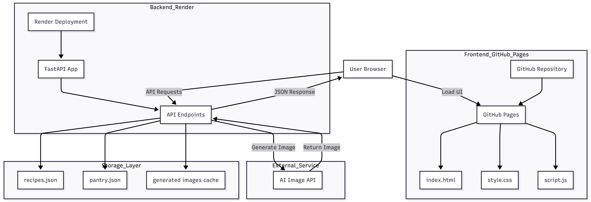

# MindMeal – AI-Powered Meal Planner

MindMeal is an intelligent meal-planning web application that suggests recipes based on the ingredients you already have.  
It generates realistic food images using an AI image API, maintains a smart pantry, provides healthy alternatives, and lets you download grocery lists inside a clean, iOS-inspired UI.

---

## Project Video

---

## Live Website

The project is live and can be accessed here:

Live Demo: https://sujalpatil21.github.io/Mind-Meal/

---

## Features

### Smart Recipe Suggestions
- Enter ingredients and get instant recipe matches  
- Veg / Non-Veg filtering  
- Highlights matched and missing ingredients  

### AI Image Generation
- High-quality recipe images generated dynamically  
- Backend-only API usage for security  

### Persistent Pantry System
- Automatically adds searched ingredients  
- Manual pantry management  
- Download pantry list  

### Healthy Alternatives
- Displays healthier ingredient swaps extracted from recipes  

### Grocery List Generator
- Download complete grocery lists for any recipe  

### Modern, Responsive UI
- iOS-inspired design  
- Smooth animations and transitions  
- Full dark mode support  

---

## System Architecture

### Deployment Overview

- Frontend hosted on GitHub Pages  
- Backend hosted on Render  
- Backend built with FastAPI  
- JSON-based lightweight storage  
- External AI Image Generation API integration  
- Cached generated images stored on backend  

---

## Architecture Diagram

---

## Backend (FastAPI + Python)

- Processes user-submitted ingredients  
- Matches recipes based on recipes.json  
- Handles pantry CRUD operations  
- Integrates with AI image generation API  
- Returns structured JSON responses  
- Caches and serves generated images  

---

## Storage Layer

- recipes.json – predefined recipe dataset  
- pantry.json – persistent pantry storage  
- generated/ – cached AI-generated images  

---

## Files Used

### Backend
- main.py  
- recipes.json  
- pantry.json  
- requirement.txt  

### Frontend
- index.html  
- script.js  
- style.css  

### Images
- Logo.png  
- small_icon.png  
- small_icon_black.png  
- Project.png  

---

## How It Works

1. User enters ingredients  
2. Frontend sends request to FastAPI backend  
3. Backend matches recipes using JSON data  
4. Frontend renders recipe cards  
5. When a recipe is selected, backend generates an AI image  
6. Generated image is cached  
7. Pantry updates automatically  
8. Grocery list can be downloaded  

---

## Installation and Setup

### Install backend dependencies

pip install fastapi uvicorn httpx pydantic

### Start backend server

uvicorn main:app --reload

### Open frontend

Open index.html in your browser.

---

## Authors

Sujal Patil – https://github.com/SujalPatil21  
Shreya Awari – https://github.com/shreyaawari28  
Tejas Halvankar – https://github.com/Tejas-H01  
Nihal Mishra – https://github.com/NihalMishra3009  
